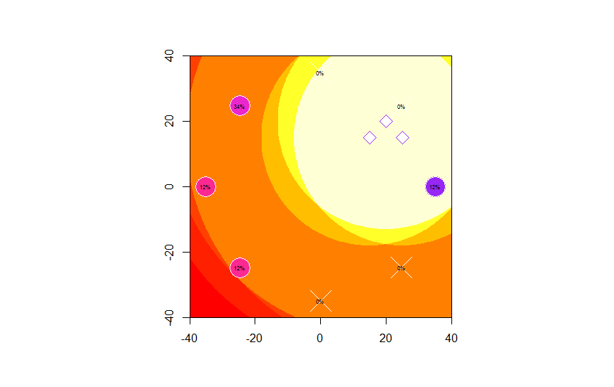

PortalSim
=========

Ingress portal attack/defense simulations based on IPAS.  Massive kudos to GraphRacer for his/her work on IPAS & the research into the latest attack mechanics that I have heavily borrowed.  Check it out:

http://ipas.graphracer.com/
http://ipas.graphracer.com/analysis.html
https://github.com/Xosofox/IPAS/

I built this to eventually run simulations to determine the best offense / defense strategies for different situations.  Right now it's a visualisation tool and not much else, though it does look nice :)

Usage
-----
The 'exploratory.r' file is written such that it can be executed all-at-once, even though it's exploratory.  To use it, open it up in your favourite R environment and tweak the options in the top half of the file.

These are the good bits.

Set up the resonators:

    res.level <- c(8,7,6,6,5,5,4,4) # starts at EAST and rotates CCW
    res.distance <- rep(35, 8)      # ditto.  distance is in METERS

Set up the bursters:

    bursters.levels = c(8,8,8)  # 3x level 8 bursters
    bursters.x = c(15, 20, 25)  # placed at (15,15), (20,20) and (20,15)
    bursters.y = c(15, 20, 15)  # 0,0 is the portal. 10,10 is 10M E and 10M N

I have included some presets for common scenarios in the file that you can comment in & out as you wish.  If you have something you want to include, send me a pull request.

If you've not used R before, c(1,2,3) creates a list with the elements 1, 2 and 3.  rep(x, 10) will repeat "x" 10 times (as a list).  You shouldn't need to know much more than that to use this script.  You can get R [here](http://www.r-project.org/) and Rstudio [here](http://www.rstudio.org/).

The burster damage heatmap can take 20-30s to load so hang in there.  The more bursters you use, the longer it takes.

Pics
----
Lazily loaded resonators attacked with 3xL8 bursters fired from a sensible location.

